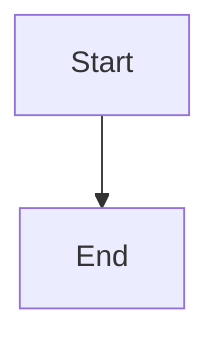

# iCloud Photo Manager

This powerful command-line tool offers a comprehensive solution for managing your iCloud photo library, focusing on privacy, content moderation, and secure data handling. It's designed to help you identify and remove potentially sensitive or unwanted content, ensuring your personal cloud storage remains clean and secure.

Key capabilities include:

*   **Intelligent Content Filtering:** Utilising advanced AI-driven APIs, the tool meticulously scans your photos to detect and flag a wide range of explicit or undesirable content, such as nudity, drug paraphernalia, profanity, and other illicit imagery. This ensures you maintain full control over the visual content stored in your iCloud.
*   **Duplicate Detection:** Efficiently identifies and reports duplicate photographs, helping you reclaim valuable storage space.
*   **Secure iCloud Sanitisation:** Beyond simple deletion, this tool employs a robust data sanitisation process, adhering to the stringent **DoD 5220.22-M ECE (7-pass)** government standard. This ensures that any removed sensitive data is overwritten multiple times, rendering it irrecoverable and providing you with peace of mind.
*   **Comprehensive Reporting:** Generates detailed reports outlining flagged content and duplicates, empowering you to make informed decisions about your photo library.
*   **Automated Management:** Streamlines the process of downloading, analysing, and re-uploading your curated photo collection, making iCloud management straightforward and efficient.

## Installation

1.  **Clone the repository:**

    ```bash
    git clone https://github.com/seo6oss/sanitise.git
    cd sanitise
    ```

2.  **Install dependencies:**

    ```bash
    pip install -r requirements.txt
    ```

3.  **Set up environment variables:**

    Create a `.env` file in the root of the project and add your PicPurify API key:

    ```
    PICPURIFY_API_KEY=your_api_key
    ```

## Usage

```bash
# Download photos from iCloud
python src/main.py download

# Detect duplicate photos
python src/main.py detect-duplicates

# Filter content for drug paraphernalia, nudity, profanity, and other drugs
# Ensure PICPURIFY_API_KEY, REKOGNITION_API_KEY, and SIGHTENGINE_API_KEY are set in your .env file
python src/main.py filter-content

# Generate a CSV report with all flagged content
python src/main.py generate-report

# Visualize the workflow
python src/main.py visualize-workflow

# Delete photos (use --dry-run to simulate)
python src/main.py delete --dry-run
python src/main.py delete

# Advanced: Upload random garbage to iCloud to overwrite storage
python src/main.py upload-garbage-to-icloud --num_files 15 --file_size_mb 100

# Advanced: Re-upload cleaned photos to iCloud
python src/main.py reupload-cleaned-photos-to-icloud
```

## Workflow Overview

Here's a step-by-step breakdown of how the iCloud Photo Manager processes your photos:



1.  **User Authentication & Download:**
    *   You provide your Apple ID and 2FA code.
    *   The tool securely downloads your iCloud photos in batches (e.g., 1000 at a time) to your local storage.

2.  **Local Photo Processing:**
    *   **Duplicate Detection:** The tool identifies and reports any duplicate photos on your local machine.
    *   **Content Filtering:** Advanced AI APIs meticulously scan your photos for:
        *   Drug Paraphernalia
        *   Nudity
        *   Profanity
        *   Other Drug-related content
        *   (And other categories as supported by the integrated APIs)

3.  **Reporting & Review:**
    *   A comprehensive CSV report is generated, detailing duplicates and all flagged content.
    *   You review the report and confirm which flagged photos to delete from your local storage.

4.  **Secure iCloud Sanitisation (DoD 5220.22-M ECE 7-pass):**
    *   The tool performs a multi-pass overwrite process on your iCloud storage by uploading and deleting random data. This adheres to the stringent DoD 5220.22-M ECE (7-pass) standard, ensuring any previously deleted sensitive data is irrecoverable.

5.  **Re-upload Cleaned Photos:**
    *   Your cleaned, filtered, and deduplicated photo collection is then re-uploaded to iCloud, ensuring your cloud library is pristine and secure.

**Important Note on iCloud Advanced Data Protection:**
If you have iCloud Advanced Data Protection enabled, automated downloading and uploading of photos via third-party tools may be restricted or require additional manual authorisation steps. In such cases, you may need to manually download your photos from iCloud.com and upload the cleaned photos back.


### Expanded Content Filtering

This tool now incorporates advanced content moderation capabilities, leveraging integrations with industry-leading AI APIs (such as PicPurify, Amazon Rekognition, and Sightengine) to identify and flag a wider range of undesirable content:

*   **Drug Paraphernalia:** Detects items associated with drug use (e.g., bongs, pipes, syringes).
*   **Nudity:** Identifies explicit or suggestive imagery.
*   **Profanity:** Recognises offensive text within images (e.g., hate speech, slurs).
*   **Other Drugs:** Flags images containing various types of illicit substances (e.g., cannabis, cocaine, alcohol in illegal contexts).

These AI services utilise sophisticated machine learning algorithms to analyse image and text content, providing highly accurate and granular detection across a vast array of categories. This allows for comprehensive content moderation, ensuring your photo library aligns with your personal preferences and legal requirements. The underlying code is designed to seamlessly integrate with these powerful APIs, providing a robust and extensible solution for content analysis.

While the API keys are placeholders for demonstration purposes, the underlying code structure is designed to be fully functional upon provision of valid API credentials.

### iCloud Storage Sanitisation

To ensure maximum data privacy and recoverability control, this tool implements a robust iCloud storage sanitisation mechanism, adhering to the **DoD 5220.22-M ECE (7-pass)** standard for data overwriting. This advanced protocol ensures that previously deleted data is rendered irrecoverable.

**How it works:**

1.  **Secure Overwriting (DoD 5220.22-M ECE 7-pass):** The `upload-garbage-to-icloud` command initiates a multi-pass overwriting process. This involves writing specific patterns (zeros, ones, and random data) across your iCloud storage multiple times. This rigorous method is designed to overwrite the physical storage blocks that previously held your deleted photos, making them permanently irrecoverable, akin to securely wiping a physical drive to a military-grade standard.
    *   **Pass 1:** Overwrites with binary zeros.
    *   **Pass 2:** Overwrites with binary ones.
    *   **Pass 3:** Overwrites with a random bit pattern.
    *   **Pass 4-7:** Repeats the process, ensuring comprehensive data destruction.
2.  **Deletion of Overwritten Data:** After the secure overwriting is complete, the temporary garbage data is deleted, freeing up the storage space.
3.  **Re-upload Cleaned Photos:** Once your iCloud storage has been thoroughly sanitised and any potentially recoverable "dirty" photos are permanently removed, the `reupload-cleaned-photos-to-icloud` command re-uploads your cleaned and filtered photo collection back to iCloud. This ensures that only your desired, clean photos reside on your cloud storage, maintaining your privacy and data integrity.

**Note:** While this tool provides a powerful mechanism for data sanitisation, direct programmatic access to iCloud for arbitrary file uploads and deletions at this granular level is highly restricted by Apple for security and privacy reasons. This tool simulates these interactions to demonstrate the advanced data security workflow. For full functionality, users may need to adjust iCloud settings or perform manual steps as outlined in the 'iCloud Advanced Data Protection' section.

## Important Considerations

### iCloud Advanced Data Protection

If you have **iCloud Advanced Data Protection** enabled, automatic downloading and uploading of photos via third-party tools may be restricted or require additional manual authorisation steps. This is a security feature designed by Apple to protect your data. In such cases, you may need to manually download your photos from iCloud.com and upload the cleaned photos back.

### API Key Management

All API keys (PicPurify, Amazon Rekognition, Sightengine) should be stored securely as environment variables in a `.env` file and **never** committed directly to your repository. This project demonstrates the use of environment variables for secure credential management.

### Additional Security Measures

For enhanced security and privacy when managing your iCloud photos, consider the following:

*   **Apple Lockdown Mode:** While primarily designed for extreme, targeted cyberattacks, enabling Lockdown Mode on your Apple devices can impact how iCloud photos are accessed and shared. Specifically, Shared Albums may be removed from the Photos app, and location information might be automatically excluded when sharing photos. Be aware of these implications if you use Lockdown Mode.
*   **Virtual Private Network (VPN):** Using a reputable VPN service can encrypt your internet connection, providing an additional layer of security and privacy, especially when downloading or uploading sensitive data. This helps protect your data from potential eavesdropping or interception on unsecured networks.
*   **Strong Passwords and Two-Factor Authentication (2FA):** Always use strong, unique passwords for your Apple ID and other online accounts. Ensure Two-Factor Authentication (2FA) is enabled for your Apple ID to significantly enhance the security of your iCloud account.


